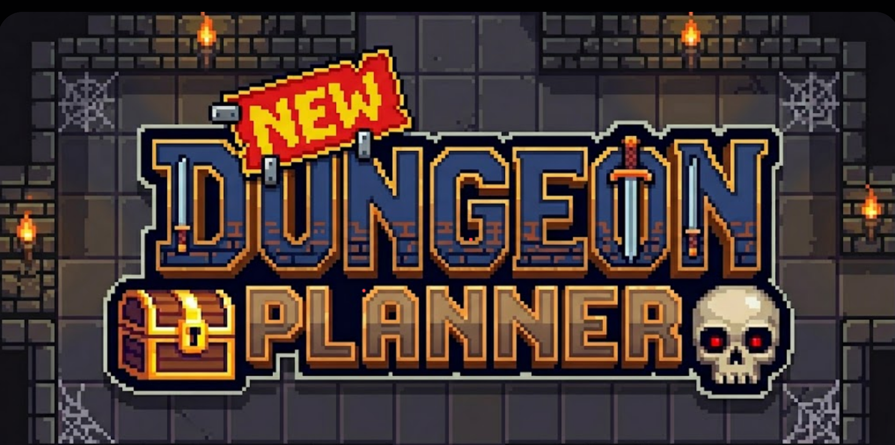

<p align="center">
  
</p>

<h1 align="center">DungeonPlanner</h1>

<p align="center">
  A 3D dungeon editor for tabletop RPG players — paint rooms, place props, and share your layout with your party.
</p>

<p align="center">
  
  
  
  
</p>

---

## Demo
https://roblibob.github.io/dungeonplanner

## Features

- 🏰 **Room painter** — click and drag to paint or erase dungeon floor tiles
- 🪑 **Prop placement** — place wall torches, furniture, and more from a content pack system
- 🔦 **Real lighting** — props can carry configurable point lights with organic flicker
- 📷 **Camera presets** — switch between Perspective, Isometric, and Top-Down views with smooth transitions
- 🎮 **Keyboard controls** — WASD / arrow keys to pan, Q / E to rotate
- 🟡 **Floor grid overlay** — TSL shader-based grid that reveals around the cursor as you edit
- 💡 **Scene light rig** — ambient and directional lights with a real-time intensity slider
- ↩️ **Undo / Redo** — full history for room painting and prop placement

## Tech Stack

| Layer | Technology |
|---|---|
| Framework | React 19 + Vite 8 |
| 3D rendering | React Three Fiber 9, Three.js 0.182 |
| Renderer | WebGPU (preferred) → WebGL fallback, both with full TSL/NodeMaterial support |
| Shaders | Three.js Shading Language (TSL) — compiles to WGSL and GLSL |
| State | Zustand 5 with undo/redo snapshots |
| Styling | Tailwind CSS 4 |
| Language | TypeScript 6 |
| Testing | Vitest + Playwright |

## Getting Started

```bash
npm install
npm run dev
```

The dev server starts at **http://localhost:5173**.

## Usage

| Tool | What it does |
|---|---|
| **Move** (hand icon) | Orbit, pan, zoom the camera. Activate camera presets and adjust the scene light rig. |
| **Room** (grid icon) | Left-drag to paint floor tiles, right-drag to erase. |
| **Prop** (torch icon) | Select a prop from the panel, click a floor tile to place it, right-click to remove. |

**Camera presets** (Move tool → right panel):

- **Perspective** — free orbit, great for building
- **Isometric** — locked true-isometric angle, good for screenshots
- **Top Down** — overhead fisheye view, ideal for printing battle maps

**Grid toggle** — shows an amber grid overlay projected over painted floor tiles. In editing tools the grid reveals in a soft circle around the cursor.

## Project Structure

```
src/
  components/
    canvas/       R3F scene, grid, camera, lighting, shader overlays
    editor/       Toolbar and tool-specific right panels
  content-packs/  Asset definitions, metadata, light configs
  hooks/          Grid snapping, raycaster helpers
  store/          Zustand state — dungeon snapshot, camera, UI
  assets/models/  GLB model files
```

## Content Packs

Props and floor/wall tiles are defined as **content packs** — plain TypeScript objects that describe the asset path, connector type, and optional light configuration.

```ts
// Example: wall torch with a real flickering point light
export const propsWallTorchAsset: ContentPackAsset = {
  id: 'core/props/wall-torch',
  name: 'Wall Torch',
  metadata: {
    connectsTo: 'WALL',
    light: {
      color: '#ff9040',
      intensity: 6,
      distance: 8,
      offset: [0, 1.6, 0.25],
      flicker: true,
    },
  },
}
```

## Scripts

```bash
npm run dev          # Start dev server
npm run build        # Production build
npm run lint         # ESLint
npm test             # Vitest unit tests
npm run test:e2e     # Playwright end-to-end tests
npm run verify       # lint + test + build + e2e (full CI gate)
```

## Roadmap

- [ ] Floor grid overlay radial reveal (TSL shader debugging in progress)
- [ ] Character token placement with movement range indicator
- [ ] Export to PNG (Top-Down view)
- [ ] More content packs (doors, traps, furniture)
- [ ] Multiplayer / shared sessions

---

<p align="center">Made for TTRPG players who want their dungeon to look as good as it plays.</p>
